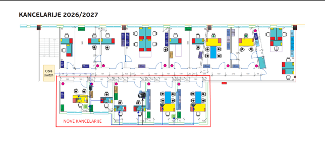

# IT Infrastructure Plan — Office Space Expansion

A complete IT infrastructure design produced from a single architectural floor plan, as part of a
practical technical assessment for an IT Administrator role. Given only the floor plan for 5 new
offices (no existing network documentation), the task was to independently plan the entire IT
infrastructure: equipment layout, network design, security, implementation phases, and a costed
equipment list.

Company-identifying details have been generalized/anonymized for public sharing.

## Input: the floor plan I was given

The plan showed 5 new offices (K1–K5) with desks, doors, and a designated core switch location —
no network diagram, no device list, no existing infrastructure documentation.

## What I produced from it

- **Equipment layout** - every device (PCs, IP phones, access points, TV screens, HUBs, the RACK
  cabinet) placed and justified against the real floor plan, not a generic template
- **Network design** - a star topology on Cat6, with VLAN segmentation (VLAN 10 workstations/phones,
  VLAN 20 WiFi staff, VLAN 30 WiFi guests), uplinked to the existing core switch
- **Security plan** - VLAN segmentation, firewall policy, port security, Active Directory/GPO,
  3-2-1 backup strategy, physical access control for the RACK
- **Implementation plan** - 4 phases, from passive cabling through active equipment to end-devices
  and final security/documentation sign-off
- **Cost estimate** - a fully itemized BAM quote (net / VAT / gross) for every piece of hardware and
  cabling

## Repository contents

| File | Description |
|---|---|
| `docs/floor-plan.png` | Original architectural floor plan (input) |
| `docs/IT_Infrastructure_Plan_Technical_Documentation.pdf` | Full technical write-up: assumptions, layout, topology, security, phasing |
| `docs/IT_Equipment_Cost_Estimate.pdf` | Itemized equipment cost estimate |

## Skills demonstrated

- Network design (star topology, VLAN segmentation, PoE planning)
- Security planning (AD/GPO, firewall policy, port security, backup strategy)
- Technical documentation writing
- Cost estimation / bill of materials
- Presentation design

## Author

Ermin Kovač
[LinkedIn](https://linkedin.com/in/ermin-kovac) · [GitHub](https://github.com/ErminKovac)
